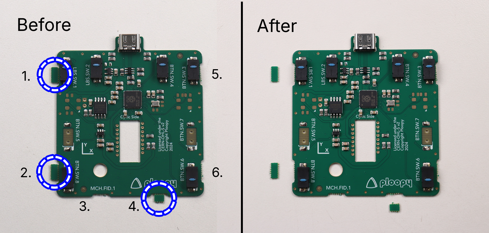
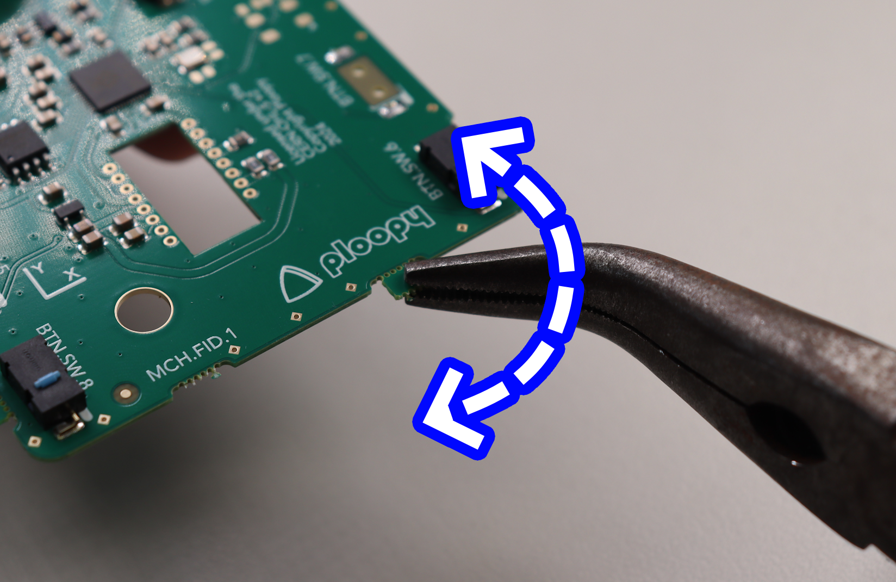

### Step 1: Prepare necessary tools

{ width="400" }

- A #1 Phillips head screwdriver
- Soldering iron
- Solder
- Optional: tweezers
- Needle-nose pliers 

  💡
  

    <strong>Tip:</strong> A similar smallish Phillips head screwdriver could work.
  

### Step 2: Break off possible leftover tabs off the PCB

  

- There are up to six possible small tabs along the edge of the PCB as shown in the picture.
- Holding the PCB as pictured, gently break off any tabs.

  

  🚨
  

    <strong>Warning:</strong> These tabs should come off relatively easily, don’t use excessive force, it probably means you are doing it wrong!
  

### Step 3: Prepare parts for PCB soldering

Prepare the following components:
- Printed circuit board
- PMW-3360 chip

  💡
  

    <strong>Tip:</strong> The PMW-3360 chip will come in a small piece of foam. Go ahead and remove it now.
  

### Step 4: Solder PMW-3360 sensor to printed circuit board

### Step 5: Remove the tab of kapton tape on the PMW-3360 chip

  💡
  

    <strong>Tip:</strong> Try to do this step in a dust-free environment.
  

There are two small tabs of orange tape covering the sensor's main holes. Remove them now.

  💡
  

    <strong>Tip:</strong> Check your solder joints during this step to ensure that they are good. To know if they are good, consult the soldering FAQ.
  

### Step 6: Attach the PMW-3360 optic to the PMW-3360 chip

Orient the optic as shown in the image before insertion.

  🚨
  

    <strong>Warning:</strong> It should NOT require any force to insert fully; if it does, remove it and check the orientation before trying again.
  

### Step 7: Place the PCB into the Base

This should be straightforward, the PCB should fit exactly as shown.

### Step 8: Place the Sensor Cap on the PCB

  💡
  

    <strong>Tip:</strong> The Sensor Cap doesn't snap onto the PMW-3360 optic. It "floats" on top of the optic for now. Once fully assembled, the Sensor Cap will be securely held down.
  

Place the sensor cap on the PCB as shown in the image.

  💡
  

    <strong>Tip:</strong> The position of the Sensor Cap doesn't precisely matter for the moment. Just try to get it roughly centered on the optic.
  

### Step 9: Place the Top Piece onto the Base Piece

Place the top onto the base.

  💡
  

    <strong>Tip:</strong> If necessary, adjust the position of the Sensor Cap as you're lowering the Top onto the Base. It should end up looking like the image.
  

### Step 10: Screw the Base into the Top

  💡
  

    <strong>Tip:</strong> You are safe to flip the frame upside down for this step.
  

Slowly drive the screws into the four holes in the top until you feel resistance.

  🚨
  

    <strong>Warning:</strong> Only screw until the frame feels firmly together. If you use too much force, you may break the frame.
  

### Step 11: Prepare 3 Roller Bearings

### Step 12: Insert Roller Bearing and Roller Bearing Dowel into Bearing

- Use the bearing press jib to make 3 bearings
- Insert the bearing into the orange cylinder part of the bearing press
- Insert dowel into black cylinder of the bearing press

### Step 13: Press the Bearing Jig Together

Press the bearing press jig together. 

  💡
  

    <strong>Tip:</strong> This may require a surprising amount of force; try your best not to bend the roller bearing dowel. If you do, there are spares included in the assembly kit.
  

### Step 14: Remove roller bearing from bearing press jig and repeat

- Remove the the roller bearing from the press jig
- Repeat 3 times to end with 3 roller bearings

### Step 15: Insert roller bearings into the Top Piece

- Insert the roller bearings into the 3 holes in the top of the frame
- Ensure the bearings are pressed all the way into the case

  💡
  

    <strong>Tip:</strong> If the bearings aren't seated all the way, there's a good chance that the ball will become badly scratched.
  

  💡
  

    <strong>Tip:</strong> Needle nose pliers or some similar tool can be used to ensure that the bearing is fully seated.
  

### Step 16: Prepare the Friction Pads

### Step 17: Place Friction Pads on Base

- Flip the adept frame upside down
- Place the friction pads on each corner of the frame

  💡
  

    <strong>Tip:</strong> Do your best not to cover the screw holes with the friction pads, as this will make opening the case more difficult in the future.
  

### Step 18: Insert the ball

- Insert the track ball into the hole in the middle of the adept frame
- Apply minimal pressure, just enough to make sure that the trackball is clicked in place

### Step 19: Peel and stick the logo to the Top

Insert the logo in the indent on the top of the frame.

### Step 20: Verify that the Ploopy Adept Trackball is working correctly

- Plug the adept trackball mouse into the computer
- Move the ball around, it should move the cursor

  💡
  

    <strong>Tip:</strong> The bearings are a bit scratchy when they're new. To prevent them from jumping around during initial use, spin the ball with some Latin dance vigour for about three minutes. That should be enough to break them in.
  

  💡
  

    <strong>Tip:</strong> The bearings will take about a week to become fully broken-in.
  

### Step 21: Spin the ball to break in the bearings

### Step 22: All done!

  ℹ️
  

    <strong>Info:</strong> If there are any issues or if you have any questions check out the FAQ page.
  

