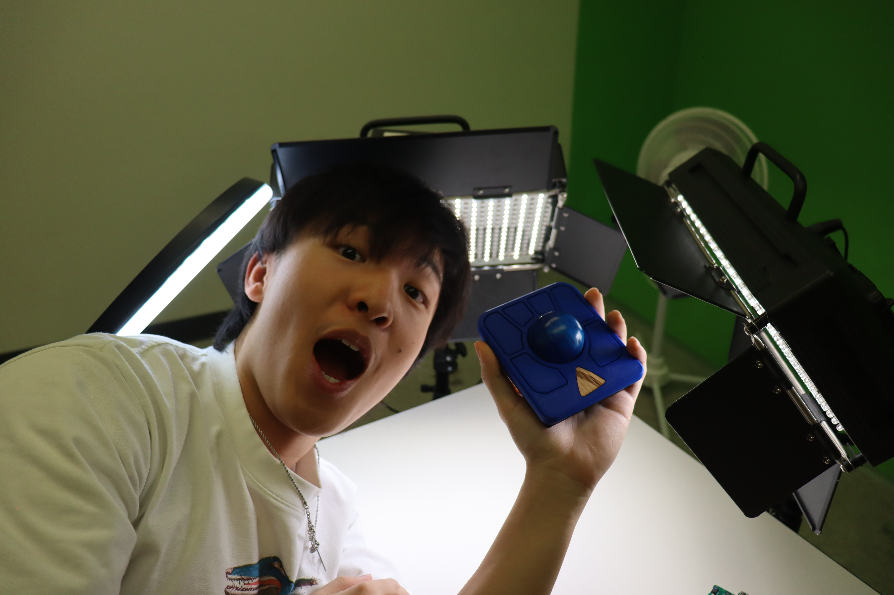

# dnnywang.github.io

# Step 1: Prepare necessary tools

  💡
  

    A similar smallish Phillips head screwdriver could work
  

- A #1 Phillips head screwdriver
- Soldering iron
- Solder
- Tweezers
- Needle-nose pliers

  💡
  

    <strong>Warning:</strong> Try to do this step in a dust-free environment
  

### This is a test

  

!!! tip "Pro Tip"
    This is much faster than writing HTML!

!!! note "Pro Note"
    This is much faster than writing HTML!

!!! warning "Warning"
    This is much faster than writing HTML!

  🚨
  

    <strong>Warning:</strong> Make sure the PMW-3360 is oriented correctly before you solder it!
  

